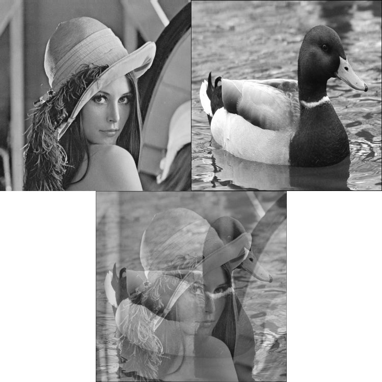
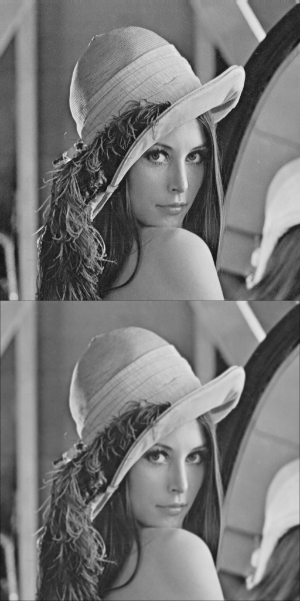
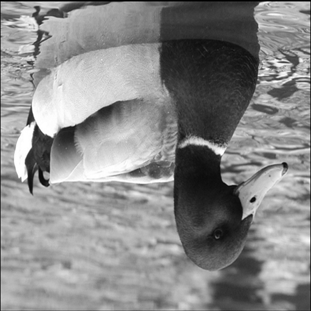
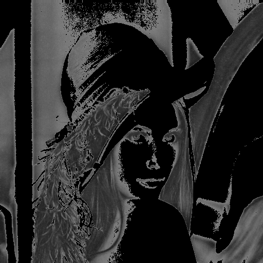
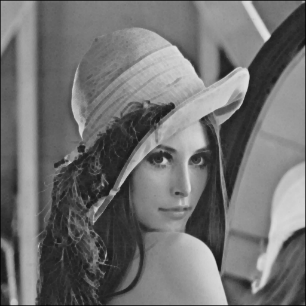
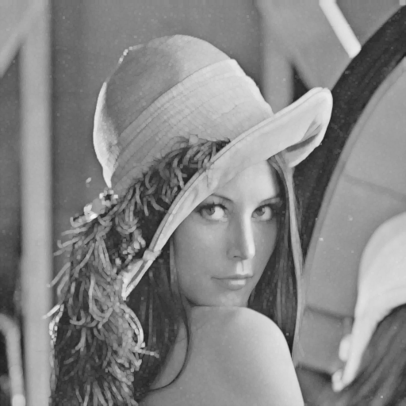
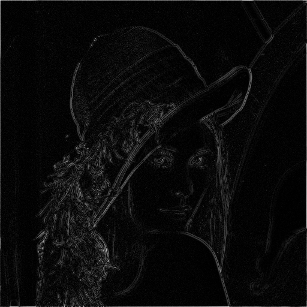
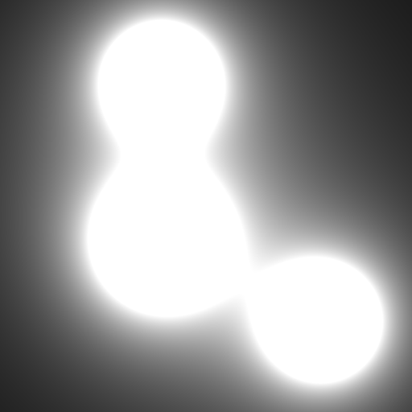
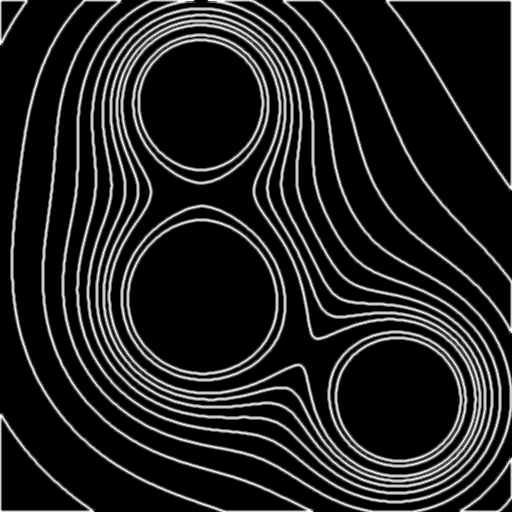

Pixslam
======= 

Pixslam is a toy programming language for image processing.

Pixslam has three main features. 

* Pixslam is dedicated to image processing, it is designed for elegantly expressing programs which operate pixel wise on images.
* Pixslam features just in time compilation (JIT) to x86-64 code, this allows for rapid experimentation with image processing which would otherwise be impossibly slow in an interpreted language.
* Pixslam is lightweight and has no complex build dependencies. It could be integrated into other applications easily.

Right now Pixslam is very much a toy. While more features are planned it is important to note this project was made for my own entertainment rather than to be _useful_.

Building Pixslam
----------------

Pixslam uses a standard CMake build. Works on Linux (probably other x86-64 unix OSs too) with recent GCC versions and Windows with Visual Studio 2012. You must build on a x86-64 (otherwise known as amd64) platform!

For Linux builds. Clone the Pixslam repository to somewhere and then do the following:

```bash
mkdir pixslam_build
cd pixslam_build
cmake /path/to/pixlsam/source/folder
make
```

For Windows builds:

 * Clone Pixslam repository
 * Fire up cmake gui (install cmake first!) and point it to the Pixslam repo and whatever build directory you want.
 * Click configure, select visual studio 11 Win64 project, and then generate.
 * Go to the build directory, open up the pixslam solution file and build all.

 In both cases it is important to build in a *separate directory* to the source.

Running Pixslam
--------------- 

The build process described above will have generated a `pixslam` executable for you. The `pixslam` command makes it very easy to run Pixslam functions on specified input images and write the resulting image to a file.

Usage:

```bash
pixslam <code> [input-images] <output>
```

Code can either be supplied directly on the command line (don't forget to surround with double quotes), or as a file path to read in. The number of input images read is dependent on the supplied code. The output argument is optional - it defaults to out.png if not specified. 

Help and simple examples for running `pixslam` are displayed if you run it with no arguments.

A reasonable number of input image formats are supported: jpeg, PNG and BMP. Colour input images can be used but Pixslam will treat them as greyscale. The output image type will be PNG regardless of the extension you give it.

Language Description and Examples
---------------------------------

### The Basics ###

Pixslam uses a lisp style [s-expressions](http://en.wikipedia.org/wiki/S-expression). If you have had any experience with these the language should be quite simple to learn.

Code for Pixslam must be a function definition. This consists of a list containing a list of arguments and then an expression which is evaluated for every pixel of the input images: 

``` lisp
((Arg1 Arg2 ...) (Expression))
```

All input images must be the same size, and the output image is the same size as the input image.

The expression part of a pixslam function defines it's behaviour. It is basically a calculator with support for indexing images. An example should hopefully make this clear.

``` lisp
; compose.psm
; Add two images together.
((A B)
     ( * 0.5 ; normalise back to [0,1]
        ( + A B) ; add the current pixel from each input image
     )
)
```

The main thing to note about this example is that it shows one method of indexing images: writing an input name as an atom (taking no arguments) evaluates to the current pixel int hat image. Pixslam will evaluate the expression for every pixel in your input images and write the result into your output image.

The comments of the above program hints at another fact: Pixslam represents pixels as floating point values (currently doubles) in the range [0,1]. When images are read in the [0,255] values are scaled down to this range, when images are written out the [0,1] range is values are scaled back to [0,255].

If we run this example after building pixslam by issuing the following command in the build directory:

```
./pixslam examples/compose.psm example_data/lena.png example_data/duck.png
```

The output will be written to `out.png`. Below you can see the inputs and results (top left `lena.png`, top right `duck.png` and the result.)

 

### Relative Indexing ####

Often when process a particular pixel we will want to look at values of neighbouring pixels. Pixslam makes this easy by providing relative indexing. If we are currently processing pixel `(i,j)` of image `A` and `a` and `b` are numbers, then the expression `(A a b)` returns the value of image `A` at pixel `(i + a, j +b)`. Note that Pixslam uses row, column lookup -- this may seem unusual but is actually very common in image processing (see Matlab, OpenCV, etc.)

A good example of this is a 3x3 normalized box filter. That is for every pixel in the image we return the mean of that pixel and it's 8 neighbouring values. This is the simplest way to _blur_ an image.

``` lisp
; box_3x3.psm
; Normalized 3x3 box filter.
; That is: replace each pixel with the average value of the pixels in 3x3 neigbourhood 
((A)
    ( /
        (
            + 
            (A -1 -1)
            (A -1 0)
            (A -1 1)
            (A 0 -1)
            (A 0 0)
            (A 0 1)
            (A 1 -1)
            (A 1 0)
            (A 1 1)
        )
        9
    )
)
```

The above example demonstrates relative indexing, the division operator, and the fact that numerical operations can accept more than two arguments (e.g. `+` can be used to sum a list.)

``` bash
# Run from the examples directory to create a blurred version of the Lenna image.
../pixslam box_3x3.psm ../example_data/lena.png box_3x3_out_1.png
```

Input and output of the above:

 

#### Image Borders

Right now image borders are handled by padding all images with a hard coded (16 pixel) border of zeros. Proper border handling strategies are on the TODO list.

### Absolute Indexing and Special Symbols ####

Pixslam also provides absolute indexing. If `A` is an image the expression `(@A y x)` will yield the value of the image at pixel `(x,y)`. Pixslam provides the special symbols `i` and `j` which are set to the current row and column of the image being processed respectively. The symbols `width` and `height` set to the width and height of the input image.

With absolute indexing we can do things like flip an image upside down.

``` lisp
; flip_vertical.psm
; Flip image vertically.
; Demos absolute indexing operator.
((A) (@A (- height i) j))
```

```bash
# Run from the example directory to create an upside down duck image.
../pixslam flip_vertical.psm ../example_data/duck.png flipped_duck.png
```
 

### Other Operators ####

#### Comparasons #####

Pixslam also features comparison operations. They are the familiar inequalities `>` `<` `>=` `>=` and also equals `==` and not equals `!=`. When given two areguments these operators return `1` if the comparison holds and `0` if it does not.

Combined with multiplication we can use comparison operations zero out parts of an image below a certain threshold.

``` lisp
; threshold.psm
; Zero out image wherever it is below 0.5
((A)
 (*
    (< A 0.5) ; zero when A < 0.5, one otherwise
    A
 )
)
```

 

Pixslam has inbuilt `min` and `max` functions which take a variable number of arguments. These can be used to implement [morphological image processing](http://www.cs.auckland.ac.nz/courses/compsci773s1c/lectures/ImageProcessing-html/topic4.htm)  operations. Below is code for _erosion_ of an image using a 3x3 neighbourhood. That is: for each pixel we replace it with the minimum value of that pixel and it's 8 neighbours.

``` lisp
; erode_3x3.psm
; Erode an image with a 3x3 kernel.
; That is: each pixel takes the value of the minimum pixel in a 3x3 neighbourhood.
((A)
    (
        min 
        (A -1 -1)
        (A -1 0)
        (A -1 1)
        (A 0 -1)
        (A 0 0)
        (A 0 1)
        (A 1 -1)
        (A 1 0)
        (A 1 1)
    )
)

```

```bash
# Run from the example directory to produce an eroded Lenna image
../pixslam erode_3x3.psm ../example_data/lena.png erode_3x3_out.png 
```

 

You can _dilate_ the image by replacing the `min` in the above code with `max`.

 

### Interesting Examples ###

#### Edges #####

Chaining together results of pixslam programs can yield some nice results. Subtracting a blurred version of an image from the original leaves bland areas close to zero and edge regions positive or negative. So taking the absolute difference of an image with a blurred version of the original gives a simple edge detector!

``` lisp
; double_absdiff.psm
; Double absolute difference (double because otherwise edges are quite dark.)
((A B) (* 2 (max (- A B) (- B A))))
```

Now run this on a box blurred Lena and the original image and you get some edges.

```
# Edge detection on the Lenna image.
../pixslam --logCommand double_absdiff.psm ../example_data/lena.png box_5x5_out_1.png lena_edge.png

```

#### Metaballs #####

[Metaballs](http://en.wikipedia.org/wiki/Metaballs) were pretty cool in the 90s. We can recreate them in Pixslam. An input image is not really needed - we only use a dummy one only to specify the output size. Everything is achieved by using the `i` and `j` variables.

``` lisp
; metaballs.psm
; Draw some nice metaballs. See: http://en.wikipedia.org/wiki/Metaballs
((A) ; input not used, just specifies size
    ( +  
        (/ 5000.0 (+ (* (- i 100) (- i 100)) (* (- j 200) (- j 200)) )) ; ball medium size at (200, 100)
        (/ 7000.0 (+ (* (- i 300) (- i 300)) (* (- j 200) (- j 200)) )) ; ball large size at (300, 200)
        (/ 5000.0 (+ (* (- i 400) (- i 400)) (* (- j 400) (- j 400)) )) ; ball medium size at (400, 400)
    )
)
```

```
# Generate Metaballs image. Input image only used to specify size.
../pixslam metaballs.psm ../example_data/lena.png metaballs_out.png
```



And after some thresholding, and the edge technique described above we end up with this:



Have a look at the examples directory after bulding to see how that was done. Start by looking at `metaball_edge.png.sh` (or `.bat` if you're on windows).

### More Information ###

The best resource for understanding Pixslam is the examples. A few of those are shown above, but the build process runs many more of example Pixslam code.

After you build Pixslam you should see an `examples` directory in your build directory. This will be filled with `.psm` Pixslam source files, generated `png` images, and shell or batch files which show how Pixslam was run to generate each output.

Libraries
---------

Pixslam uses two libraries. They are both great so I want to spread the word.

* [AsmJit](https://code.google.com/p/asmjit/) as a runtime assembler and compiler. This project would not exist whitout AsmJit.
* The wonderful [stb_image](http://nothings.org/stb_image.c) for image reading/writing. Avoiding large/complex/annoying image reading libraries let me get stuck into the interesting code much faster, and makes for a much easier build process.

License
-------

This code is licensed under the zlib license.
